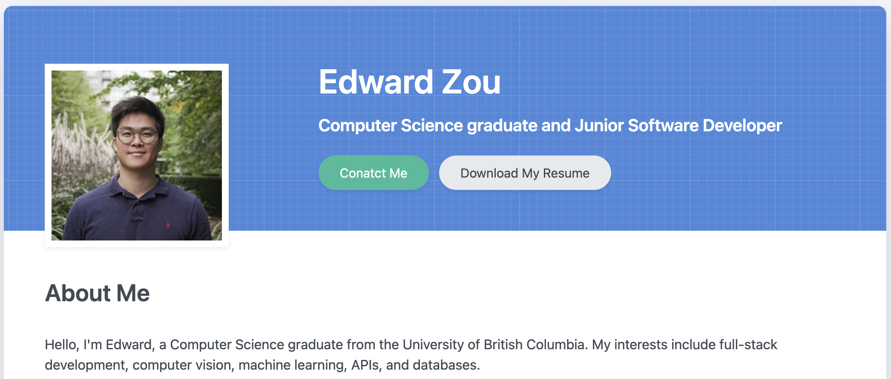

# Django Portfolio Website

by Edward Zou | 18 November 2023





## Intro

This is my simple and personal portfolio website utilizing the technologies below:

* Python - Django
* Database with SQLite3 (can switch to PostgreSQL, MySQL)
* Bootstrap with localized CSS files
* JavaScript
* Docker deployment


## Future plan

Thinking about re-writing the webapp using `React/MaterialUI + Express + SQLite3/PostgreSQL + Tailwind` in the future.


## How to run the Webapp locally

1. Pull down the GitHub repo and extract to a local folder, then run the command:

   ```
   cd edwardzou.com
   ```

2. Install the libraries in `requirement.txt` locally.

   ```
   pip install -r requirements.txt
   ```

3. Open the terminal in VS Code and type in:

   ```
   python manage.py runserver
   ```

4. then open a browser and point to https://localhost:8000.


## Deploy the Webapp to your GitHub

1. Create a repo on your GitHub account, say `digicv2dj`.

2. Push the webapp to the GitHub:

   ```
   git init
   git add .
   git commit -m "DigiCV2dj-1st-commit"
   git branch -M main
   git remote add origin https://github.com/<YourGitHubAccount>/DigiCV2dj.git
   git push -u origin main
   ```


## Env. of Dockerizing the Webapp on render.com

```
PYTHON_VERSION: 3.11.6
NODE_VERSION: 18.16.0
PORT: 8000
```


## License

\- GPL


## Website Version

version 2.0.7 - 2023.11.20
